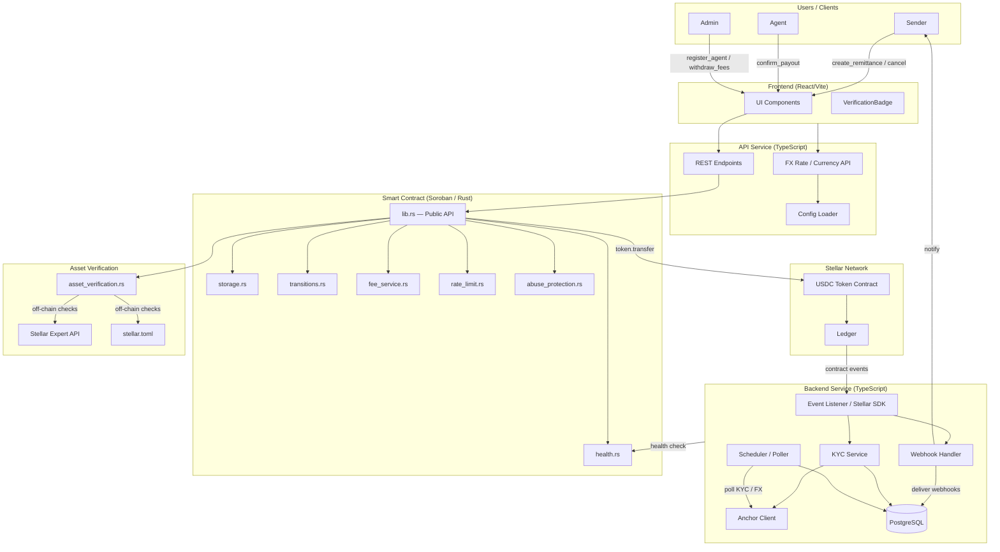
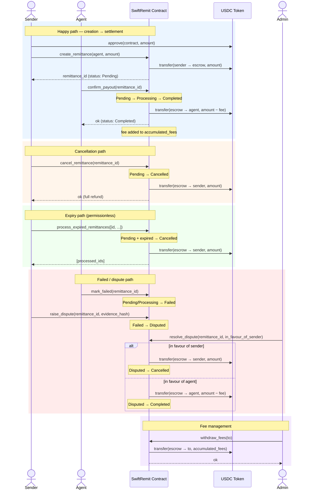

# SwiftRemit

[](https://github.com/Haroldwonder/SwiftRemit/actions/workflows/contract-ci.yml)

Production-ready Soroban smart contract for USDC remittance platform on Stellar blockchain.

## Overview

SwiftRemit is an escrow-based remittance system that enables secure cross-border money transfers using USDC stablecoin. The platform connects senders with registered agents who handle fiat payouts, with the smart contract managing escrow, fee collection, and settlement.

## Features

- **Escrow-Based Transfers**: Secure USDC deposits held in contract until payout confirmation
- **Agent Network**: Registered agents handle fiat distribution off-chain
- **Automated Fee Collection**: Platform fees calculated and accumulated automatically
- **Lifecycle State Management**: Remittances tracked through 6 states (Pending, Processing, Completed, Cancelled, Failed, Disputed) with enforced transitions via a single canonical `RemittanceStatus` enum
- **Authorization Security**: Role-based access control for all operations
- **Event Emission**: Comprehensive event logging for off-chain monitoring
- **Cancellation Support**: Senders can cancel pending remittances with full refund
- **Admin Controls**: Platform fee management and fee withdrawal capabilities
- **Daily Send Limits**: Admin-configurable rolling 24h limits per currency/country
- **Off-Chain Proof Commitments**: Optional proof validation before payout confirmation

## Architecture



### Core Components

- **lib.rs**: Main contract implementation with all public functions
- **types.rs**: Data structures (Remittance, RemittanceStatus)
- **transitions.rs**: State transition validation and enforcement
- **storage.rs**: Persistent and instance storage management
- **errors.rs**: Custom error types for contract operations
- **events.rs**: Event emission functions for monitoring
- **test.rs**: Comprehensive test suite with 15+ test cases
- **test_transitions.rs**: Lifecycle transition tests

### Storage Model

- **Instance Storage**: Admin, USDC token, fee configuration, counters, accumulated fees
- **Persistent Storage**: Individual remittances, agent registrations

### Fee Calculation

Fees are calculated in basis points (bps):
- 250 bps = 2.5%
- 500 bps = 5.0%
- Formula: `fee = amount * fee_bps / 10000`

## Contract Functions

### Administrative Functions

- `initialize(admin, usdc_token, fee_bps)` - One-time contract initialization
- `register_agent(agent)` - Add agent to approved list (admin only)
- `remove_agent(agent)` - Remove agent from approved list (admin only)
- `update_fee(fee_bps)` - Update platform fee percentage (admin only)
- `set_daily_limit(currency, country, limit)` - Configure sender limits by corridor (admin only)
- `withdraw_fees(to)` - Withdraw accumulated platform fees (admin only)
- `withdraw_integrator_fees(integrator, to)` - Withdraw accumulated integrator fees (integrator auth required)

### User Functions

- `create_remittance(sender, agent, amount)` - Create new remittance (sender auth required)
- `start_processing(remittance_id)` - Mark remittance as being processed (agent auth required)
- `confirm_payout(remittance_id, proof)` - Confirm fiat payout with optional commitment proof
- `confirm_partial_payout(remittance_id, amount)` - Disburse a partial amount to the agent; automatically marks the remittance Completed when the total disbursed reaches the net payout (agent auth required)
- `mark_failed(remittance_id)` - Mark payout as failed and auto-refund escrow to sender (agent auth required)
- `cancel_remittance(remittance_id)` - Cancel pending remittance (sender auth required)
- `process_expired_remittances(remittance_ids)` - Auto-refund expired pending remittances in batches (max 50 IDs)

### Query Functions

- `get_remittance(remittance_id)` - Retrieve remittance details
- `get_accumulated_fees()` - Check total platform fees collected
- `is_agent_registered(agent)` - Verify agent registration status
- `is_token_whitelisted(token)` - Check whether a token is currently accepted
- `get_admin_count()` - Read the number of registered admins
- `get_platform_fee_bps()` - Get current fee percentage
- `get_rate_limit_status(address)` - Read current rate-limit usage for an address
- `get_daily_limit(currency, country)` - Read configured daily send limit for a corridor
- `get_remittance_count()` - Total number of remittances ever created
- `get_total_volume()` - Cumulative volume of all completed remittances (original amounts)
- `health()` - On-chain health check: initialized, paused, admin_count, total_remittances, accumulated_fees

## Security Features

1. **Authorization Checks**: All state-changing operations require proper authorization
2. **Status Validation**: Prevents double confirmation and invalid state transitions
3. **Overflow Protection**: Safe math operations with overflow checks
4. **Agent Verification**: Only registered agents can receive payouts
5. **Ownership Validation**: Senders can only cancel their own remittances

## Testing

The contract includes comprehensive tests covering:

- ✅ Initialization and configuration
- ✅ Agent registration and removal
- ✅ Fee updates and validation
- ✅ Remittance creation with proper token transfers
- ✅ Payout confirmation and fee accumulation
- ✅ Cancellation logic and refunds
- ✅ Fee withdrawal by admin
- ✅ Authorization enforcement
- ✅ Error conditions (invalid amounts, unauthorized access, double confirmation)
- ✅ Event emission verification
- ✅ Multiple remittances handling
- ✅ Fee calculation accuracy

Run tests with:
```bash
cargo test
```

## Quick Start

### 🚀 Complete Testnet Setup (Recommended)

Get up and running with testnet XLM, USDC, and a full end-to-end flow:

**Linux/macOS:**
```bash
./setup-testnet.sh
```

**Windows (PowerShell):**
```powershell
.\setup-testnet.ps1
```

This automated script will:
- Generate and fund test accounts with XLM
- Deploy SwiftRemit contract and mock USDC token
- Register agents and mint test USDC
- Run a complete test remittance flow
- Save all configuration files

**📖 For detailed instructions:** [QUICK_START.md](QUICK_START.md) | [TESTNET_SETUP_GUIDE.md](TESTNET_SETUP_GUIDE.md)

### Contract-Only Deployment

If you just need to deploy the contract:

**Linux/macOS:**
```bash
chmod +x deploy.sh
./deploy.sh testnet
```

**Windows (PowerShell):**
```powershell
.\deploy.ps1 -Network testnet
```

### Manual Setup

If you prefer to run steps manually:

### 1. Build the Contract

```bash
cd SwiftRemit
cargo build --target wasm32-unknown-unknown --release
soroban contract optimize --wasm target/wasm32-unknown-unknown/release/swiftremit.wasm
```

### 2. Deploy to Testnet

```bash
soroban contract deploy \
  --wasm target/wasm32-unknown-unknown/release/swiftremit.optimized.wasm \
  --source deployer \
  --network testnet
```

### 3. Initialize

```bash
soroban contract invoke \
  --id <CONTRACT_ID> \
  --source deployer \
  --network testnet \
  -- \
  initialize \
  --admin <ADMIN_ADDRESS> \
  --usdc_token <USDC_TOKEN_ADDRESS> \
  --fee_bps 250
```

See [DEPLOYMENT.md](DEPLOYMENT.md) for complete deployment instructions.

For production readiness assessment, see [PRODUCTION_READINESS_REPORT.md](PRODUCTION_READINESS_REPORT.md).

## Staging Environment

Every merge to `main` automatically triggers a deployment to the staging environment (Stellar **testnet**) via `.github/workflows/deploy-staging.yml`.

| Service  | Staging URL |
|----------|-------------|
| API      | `https://api.staging.swiftremit.io` |
| Backend  | `https://backend.staging.swiftremit.io` |
| Frontend | `https://staging.swiftremit.io` |

> **Note:** The staging URLs above are placeholders. Configure the actual URLs as GitHub Actions variables `STAGING_API_URL` and `STAGING_BACKEND_URL` in the repository's *Settings → Environments → staging*.

### How it works

1. Docker images for `backend`, `api`, and `frontend` are built and pushed to **GHCR** (`ghcr.io/<owner>/SwiftRemit/<service>:staging`).
2. The workflow SSH-es into the staging VM and runs `docker compose up -d` with the new image tags.
3. **Smoke tests** (`scripts/smoke-test-staging.sh`) run immediately after deploy to verify health and key API endpoints. The workflow fails if any check returns an unexpected status code.

### Required repository secrets / variables

| Name | Kind | Description |
|------|------|-------------|
| `STAGING_HOST` | Secret | IP or hostname of the staging VM |
| `STAGING_USER` | Secret | SSH username |
| `STAGING_SSH_KEY` | Secret | Private key for SSH access |
| `STAGING_SSH_PORT` | Secret | SSH port (default: 22) |
| `STAGING_API_URL` | Variable | Base URL for the API service |
| `STAGING_BACKEND_URL` | Variable | Base URL for the backend service |

## Environment Validation

A script checks that every env variable consumed in source code is present in the corresponding `.env.example` file. CI fails automatically if any are missing.

Run locally:

```bash
node scripts/validate-env-examples.js
```

Covers: root `.env.example`, `api/.env.example`, `backend/.env.example`, `frontend/.env.example`.

## Configuration

SwiftRemit uses environment variables for configuration. This allows you to easily configure the system for different environments (local development, testnet, mainnet) without modifying code.

### Quick Setup

1. Copy the example environment file:
   ```bash
   cp .env.example .env
   ```

2. Edit `.env` and fill in your configuration:
   ```bash
   # Required for client operations
   SWIFTREMIT_CONTRACT_ID=your_contract_id_here
   USDC_TOKEN_ID=your_usdc_token_id_here
   
   # Optional: customize other settings
   NETWORK=testnet
   DEFAULT_FEE_BPS=250
   ```

3. Your configuration is automatically loaded when running client code or deployment scripts

### Configuration Files

- **`.env`**: Your local environment configuration (gitignored, never commit this)
- **`.env.example`**: Template with all available configuration options
- **`examples/config.js`**: JavaScript configuration module that loads and validates environment variables

### Key Configuration Variables

- `NETWORK`: Network to connect to (`testnet` or `mainnet`)
- `RPC_URL`: Soroban RPC endpoint URL
- `SWIFTREMIT_CONTRACT_ID`: Deployed contract address
- `USDC_TOKEN_ID`: USDC token contract address
- `DEFAULT_FEE_BPS`: Platform fee in basis points (0-10000)
- `INITIAL_FEE_BPS`: Initial fee for contract deployment (0-10000)
- `DEPLOYER_IDENTITY`: Soroban CLI identity for deployment

### Documentation

- **[CONFIGURATION.md](CONFIGURATION.md)**: Complete configuration reference with all variables, validation rules, and examples
- **[MIGRATION.md](MIGRATION.md)**: Migration guide for existing developers
- **[RUNBOOK.md](RUNBOOK.md)**: Operational runbook — emergency pause/unpause, admin key rotation, stuck migrations, webhook replay, storage TTL extension
- **[PRODUCTION_READINESS_REPORT.md](PRODUCTION_READINESS_REPORT.md)**: Current production readiness status — what's complete, what's pending, and known risks before mainnet

## Remittance Lifecycle — Sequence Diagram



## State Machine

All remittance lifecycle state is tracked by a single canonical `RemittanceStatus` enum:

```
┌─────────┐
│ Pending │  ← initial state (funds locked in escrow)
└────┬────┘
     │
     ├──────────────────────┬──────────────────────┐
     │                      │                      │
     ▼                      ▼                      ▼
┌────────────┐        ┌───────────┐          ┌────────┐
│ Processing │        │ Cancelled │(Terminal) │ Failed │
└─────┬──────┘        └───────────┘          └───┬────┘
      │                      ▲                   │
      ├──────────────────────┤                   │
      │                      │                   ▼
      ▼                      │            ┌──────────┐
┌───────────┐                │            │ Disputed │
│ Completed │(Terminal)      │            └────┬─────┘
└───────────┘                │                 │
                             │    Cancelled ◄──┤
                             │                 │
                             └──── Completed ◄─┘
```

### Valid Transitions

| From       | To         | Trigger                        |
|------------|------------|--------------------------------|
| Pending    | Processing | Contract enters processing during `confirm_payout` |
| Pending    | Cancelled  | Sender calls `cancel_remittance` or expiry processed |
| Pending    | Failed     | Agent calls `mark_failed` |
| Processing | Completed  | `confirm_payout` completes successfully and releases USDC |
| Processing | Cancelled  | Expiry or internal failure/refund path |
| Processing | Failed     | Agent calls `mark_failed` |
| Failed     | Disputed   | Sender calls `raise_dispute` within dispute window |
| Disputed   | Cancelled  | Admin calls `resolve_dispute` in favour of sender |
| Disputed   | Completed  | Admin calls `resolve_dispute` in favour of agent |

Terminal states (`Completed`, `Cancelled`) cannot transition further. `Failed` and `Disputed` are transient — further transitions are permitted from both.


1. **Admin Setup**
   - Deploy contract
   - Initialize with admin address, USDC token, and fee percentage
   - Register trusted agents

2. **Create Remittance**
   - Sender approves USDC transfer to contract
   - Sender calls `create_remittance` with agent and amount
   - Contract transfers USDC from sender to escrow
   - Remittance ID returned for tracking (status: Pending)

3. **Agent Payout**
   - Agent pays out fiat to recipient off-chain
   - Agent calls `confirm_payout` with remittance ID
   - During `confirm_payout`, the contract moves the remittance through `Processing` and then to `Completed`
   - Contract transfers USDC minus fee to agent
   - Fee added to accumulated platform fees

4. **Alternative Flows**
   - **Early Cancellation**: Sender calls `cancel_remittance` while Pending
   - There is no separate public `start_processing` or `mark_failed` function in the current contract API

5. **Fee Management**
   - Admin monitors accumulated fees
   - Admin calls `withdraw_fees` to collect platform revenue

## Error Codes

| Code | Error | Description |
|------|-------|-------------|
| 1 | AlreadyInitialized | Contract already initialized |
| 2 | NotInitialized | Contract not initialized |
| 3 | InvalidAmount | Amount must be greater than 0 |
| 4 | InvalidFeeBps | Fee must be between 0-10000 bps |
| 5 | AgentNotRegistered | Agent not in approved list |
| 6 | RemittanceNotFound | Remittance ID does not exist |
| 7 | InvalidStatus | Operation not allowed in current status |
| 8 | InvalidStateTransition | Invalid state transition attempted |
| 9 | NoFeesToWithdraw | No accumulated fees available |
| 10 | InvalidAddress | Invalid address format or validation failed |
| 11 | SettlementExpired | Settlement window has expired |
| 12 | DuplicateSettlement | Settlement already executed |
| 13 | ContractPaused | Contract is paused; settlements temporarily disabled |
| 14 | AssetNotFound | Asset verification record not found |
| 15 | UserBlacklisted | User is blacklisted and cannot perform transactions |
| 16 | InvalidReputationScore | Reputation score must be between 0 and 100 |
| 17 | KycNotApproved | User KYC is not approved |
| 18 | SuspiciousAsset | Asset has been flagged as suspicious |
| 19 | AnchorTransactionFailed | Anchor withdrawal/deposit operation failed |
| 20 | Unauthorized | Caller is not authorized to perform this operation |
| 21 | DailySendLimitExceeded | User's daily send limit exceeded |
| 22 | TokenAlreadyWhitelisted | Token is already whitelisted |
| 23 | KycExpired | User KYC has expired and needs renewal |
| 24 | TransactionNotFound | Transaction record not found |
| 25 | RateLimitExceeded | Rate limit exceeded |
| 26 | AdminAlreadyExists | Admin address already registered |
| 27 | AdminNotFound | Admin address not found |
| 28 | CannotRemoveLastAdmin | Cannot remove the last admin |
| 29 | TokenNotWhitelisted | Token is not whitelisted |
| 30 | InvalidMigrationHash | Migration hash verification failed |
| 31 | MigrationInProgress | Migration already in progress or completed |
| 32 | InvalidMigrationBatch | Migration batch out of order or invalid |
| 33 | CooldownActive | Cooldown period is still active |
| 34 | SuspiciousActivity | Suspicious activity detected |
| 35 | ActionBlocked | Action temporarily blocked due to abuse protection |
| 36 | Overflow | Arithmetic overflow detected |
| 37 | NetSettlementValidationFailed | Net settlement validation failed |
| 38 | EscrowNotFound | Escrow record not found |
| 39 | InvalidEscrowStatus | Invalid escrow status for this operation |
| 40 | SettlementCounterOverflow | Settlement counter overflow |
| 41 | InvalidBatchSize | Invalid batch size for batch operations |
| 42 | DataCorruption | Data corruption detected in stored values |
| 43 | IndexOutOfBounds | Index out of bounds |
| 44 | EmptyCollection | Collection is empty |
| 45 | KeyNotFound | Key not found in map |
| 46 | StringConversionFailed | String conversion failed |
| 47 | InvalidSymbol | Invalid or malformed symbol string |
| 48 | Underflow | Arithmetic underflow occurred |
| 49 | IdempotencyConflict | Idempotency key conflict with different payload |
| 50 | InvalidProof | Proof validation failed |
| 51 | MissingProof | Proof is required but not provided |
| 52 | InvalidOracleAddress | Oracle address is invalid or not configured |

## Events

The contract emits events for monitoring:

- `created` - New remittance created
- `completed` - Payout confirmed and settled
- `cancelled` - Remittance cancelled by sender
- `agent_reg` - Agent registered
- `agent_rem` - Agent removed
- `fee_upd` - Platform fee updated
- `fees_with` - Fees withdrawn by admin

## Dependencies

- `soroban-sdk = "25.3.1"` - Latest Soroban SDK

## License

MIT

## Support

For issues and questions:
- GitHub Issues: [Create an issue](https://github.com/yourusername/swiftremit/issues)
- Stellar Discord: https://discord.gg/stellar
- Documentation: See [DEPLOYMENT.md](DEPLOYMENT.md)

## Contributing

Contributions are welcome! We appreciate your help in making SwiftRemit better.

Please see [CONTRIBUTING.md](CONTRIBUTING.md) for detailed guidelines on:
- Setting up your development environment
- Coding standards and best practices
- Running tests locally
- Submitting pull requests
- Creating issues

Quick checklist:
- All tests pass: `cargo test`
- Code follows project style guidelines
- New features include tests
- Documentation is updated

## Asset Verification System

SwiftRemit now includes a comprehensive asset verification system that validates Stellar assets against multiple trusted sources. See [ASSET_VERIFICATION.md](ASSET_VERIFICATION.md) for complete documentation.

### Features

- ✅ Multi-source verification (Stellar Expert, TOML, trustlines, transaction history)
- ✅ On-chain storage of verification results
- ✅ RESTful API for verification queries
- ✅ React component for visual trust indicators
- ✅ Background job for periodic revalidation
- ✅ Community reporting system
- ✅ Reputation scoring (0-100)
- ✅ Suspicious asset detection and warnings

### Quick Start

```bash
# Start backend service
cd backend
npm install
cp .env.example .env
npm run dev

# Use in React
import { VerificationBadge } from './components/VerificationBadge';

<VerificationBadge assetCode="USDC" issuer="GA5Z..." />
```

## Roadmap

- [x] Asset verification system
- [x] Integration with fiat on/off ramps (via SEP-24)
- [ ] Multi-currency support
- [ ] Batch remittance processing
- [ ] Agent reputation system
- [ ] Dispute resolution mechanism
- [ ] Time-locked escrow options

## Error Codes & Troubleshooting

| Code | Error Name | Common Cause | Resolution Steps |
| :--- | :--- | :--- | :--- |
| **1** | AlreadyInitialized | Attempting to call initialize() on an active contract. | No action required. If re-configuration is needed, check if an update function exists. |
| **2** | NotInitialized | Operations attempted before the contract setup is complete. | The administrator must call the initialize() function with valid parameters. |
| **3** | InvalidAmount | Providing zero or negative values for remittance. | Ensure the transfer amount is a positive integer greater than 0. |
| **4** | InvalidFeeBps | Fee percentage is set outside the 0-100% (0-10000 bps) range. | Adjust the basis points to fall within the valid range (e.g., 2.5% = 250 bps). |
| **5** | AgentNotRegistered | Using an address that hasn't been added to the whitelist. | Register the agent address first using the 
egister_agent function. |
| **6** | RemittanceNotFound | Querying an ID that does not exist on the ledger. | Verify the Remittance ID from your transaction history or event logs. |
| **7** | InvalidStatus | Operation not allowed in current state (e.g. canceling a settled payment). | Check the current status of the remittance via get_remittance before retrying. |
| **11** | SettlementExpired | The time-lock for the remittance has passed. | The sender may need to cancel and recreate the remittance with a new deadline. |
| **12** | DuplicateSettlement | The payment was already claimed or processed. | Check the transaction ledger; the funds have likely already been disbursed. |
| **13** | ContractPaused | Circuit breaker active due to maintenance or emergency. | Monitor the project's official status channels; wait for the admin to unpause. |

