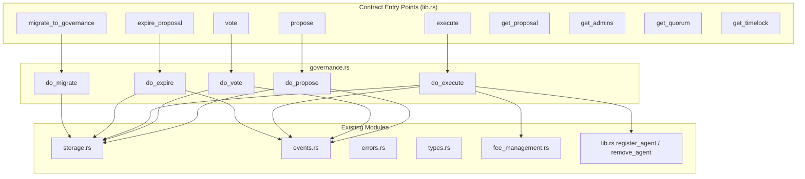
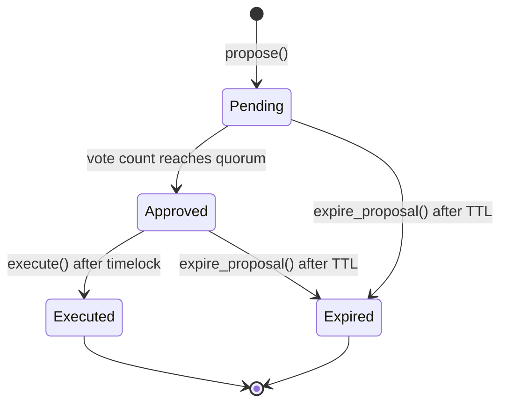

# Design Document: Multi-Admin / DAO Governance Support

## Overview

This design replaces SwiftRemit's single-admin model with a multi-signature governance
system built directly into the existing Soroban contract. The governance module introduces
a proposal lifecycle (create → vote → execute) that gates all privileged operations —
fee updates, agent management, and admin set changes — behind a configurable quorum of
admin approvals and an optional timelock delay.

The design builds on the existing `AdminRole` / `AdminCount` storage scaffolding and
reuses the `Role::Admin` authorization primitive already present in `storage.rs`. It
introduces a new `governance.rs` module and extends `storage.rs`, `errors.rs`,
`events.rs`, and `types.rs` with the new data structures and error codes needed.

### Key Design Decisions

1. **Single-module governance**: All proposal logic lives in `src/governance.rs` to keep
   the blast radius of changes small and auditable.
2. **Monotonic proposal IDs**: A `ProposalCounter` instance-storage key provides
   collision-free, replay-resistant IDs.
3. **Typed action enum**: `ProposalAction` is a Soroban `contracttype` enum covering all
   three action categories; this makes the storage layout explicit and avoids stringly-typed
   dispatch.
4. **Pending-proposal guards**: Fee and agent proposals carry a "one active at a time"
   invariant enforced at proposal creation via dedicated storage flags.
5. **Backward-compatible migration path**: The `DataKey::Admin` (Legacy_Admin) entry is
   preserved and updated on the first admin-add execution, so existing read-only callers
   continue to work without modification.
6. **Reuse of circuit-breaker patterns**: The vote-recording pattern (`VoteFlag` keyed by
   `(proposal_id, voter)`) mirrors the existing `UnpauseVote(u64, Address)` key, keeping
   the storage layout consistent.

---

## Architecture



### Proposal Lifecycle State Machine



---

## Components and Interfaces

### New Module: `src/governance.rs`

This module exposes five internal functions called from `lib.rs` entry points.

```rust
pub fn do_propose(
    env: &Env,
    proposer: &Address,
    action: ProposalAction,
) -> Result<u64, ContractError>;

pub fn do_vote(
    env: &Env,
    voter: &Address,
    proposal_id: u64,
    approve: bool,
) -> Result<(), ContractError>;

pub fn do_execute(
    env: &Env,
    executor: &Address,
    proposal_id: u64,
) -> Result<(), ContractError>;

pub fn do_expire(
    env: &Env,
    caller: &Address,
    proposal_id: u64,
) -> Result<(), ContractError>;

pub fn do_migrate(
    env: &Env,
    caller: &Address,
    quorum: u32,
    timelock_seconds: u64,
    proposal_ttl_seconds: u64,
) -> Result<(), ContractError>;
```

### New `lib.rs` Entry Points

```rust
// Governance entry points added to SwiftRemitContract impl
pub fn propose(env: Env, proposer: Address, action: ProposalAction) -> Result<u64, ContractError>;
pub fn vote(env: Env, voter: Address, proposal_id: u64, approve: bool) -> Result<(), ContractError>;
pub fn execute(env: Env, executor: Address, proposal_id: u64) -> Result<(), ContractError>;
pub fn expire_proposal(env: Env, caller: Address, proposal_id: u64) -> Result<(), ContractError>;
pub fn migrate_to_governance(
    env: Env,
    caller: Address,
    quorum: u32,
    timelock_seconds: u64,
    proposal_ttl_seconds: u64,
) -> Result<(), ContractError>;

// Read-only governance queries
pub fn get_proposal(env: Env, proposal_id: u64) -> Result<Proposal, ContractError>;
pub fn get_admins(env: Env) -> Vec<Address>;
pub fn get_quorum(env: Env) -> u32;
pub fn get_timelock_seconds(env: Env) -> u64;
```

### Modified Modules

- **`src/types.rs`**: Add `ProposalAction`, `ProposalState`, `Proposal` types.
- **`src/errors.rs`**: Add new error variants (see Data Models section).
- **`src/events.rs`**: Add governance event emission functions.
- **`src/storage.rs`**: Add new `DataKey` variants and accessor functions.

---

## Data Models

### New Types (`src/types.rs`)

```rust
/// The action a proposal will execute if approved.
#[contracttype]
#[derive(Clone, Debug, Eq, PartialEq)]
pub enum ProposalAction {
    UpdateFee(u32),                          // fee_bps
    RegisterAgent(Address),
    RemoveAgent(Address),
    AddAdmin(Address),
    RemoveAdmin(Address),
    UpdateQuorum(u32),
    UpdateTimelock(u64),                     // timelock_seconds
}

/// Lifecycle state of a governance proposal.
#[contracttype]
#[derive(Clone, Debug, Eq, PartialEq)]
pub enum ProposalState {
    Pending,
    Approved,
    Executed,
    Rejected,
    Expired,
}

/// A governance proposal record stored on-chain.
#[contracttype]
#[derive(Clone, Debug, Eq, PartialEq)]
pub struct Proposal {
    pub id: u64,
    pub proposer: Address,
    pub action: ProposalAction,
    pub state: ProposalState,
    pub created_at: u64,          // ledger timestamp
    pub expiry: u64,              // created_at + proposal_ttl_seconds
    pub approval_count: u32,
    pub approval_timestamp: Option<u64>,  // set when state → Approved
}
```

### New Storage Keys (`src/storage.rs` `DataKey` enum additions)

```rust
// Governance
/// Monotonically increasing proposal ID counter (instance storage).
GovernanceProposalCounter,

/// Proposal record indexed by proposal_id (persistent storage).
GovernanceProposal(u64),

/// Vote flag: (proposal_id, voter_address) → bool (persistent storage).
GovernanceVote(u64, Address),

/// Configured quorum for governance proposals (instance storage).
GovernanceQuorum,

/// Timelock in seconds between approval and execution (instance storage).
GovernanceTimelockSeconds,

/// TTL in seconds for proposals before they expire (instance storage).
GovernanceProposalTtl,

/// Flag: a Fee_Update_Proposal is currently active (instance storage).
ActiveFeeProposal,

/// Flag: governance has been initialized via migrate_to_governance (instance storage).
GovernanceInitialized,

/// Ordered list of current admin addresses for iteration (instance storage).
AdminList,
```

### New Error Variants (`src/errors.rs`)

New variants are appended starting at the next available code (63+):

```rust
/// A proposal with this action type is already pending or approved.
ProposalAlreadyPending = 63,

/// The proposal was not found.
ProposalNotFound = 64,

/// The proposal is not in the required state for this operation.
InvalidProposalState = 65,

/// The governance timelock has not yet elapsed.
TimelockNotElapsed = 66,

/// The address is already an Admin.
AlreadyAdmin = 67,

/// Removing this admin would drop the count below the quorum.
InsufficientAdmins = 68,

/// The agent is already registered.
AgentAlreadyRegistered = 69,

/// Governance has already been initialized.
GovernanceAlreadyInitialized = 70,
```

> Note: `AlreadyVoted` (59), `InvalidQuorum` (61), `Unauthorized` (20),
> `AgentNotRegistered` (5), and `ContractPaused` (13) are reused from existing variants.

### Governance Storage Accessor Functions

```rust
// Proposal CRUD
pub fn get_proposal(env: &Env, id: u64) -> Result<Proposal, ContractError>;
pub fn set_proposal(env: &Env, proposal: &Proposal);

// Vote tracking
pub fn has_governance_voted(env: &Env, proposal_id: u64, voter: &Address) -> bool;
pub fn record_governance_vote(env: &Env, proposal_id: u64, voter: &Address);

// Config
pub fn get_governance_quorum(env: &Env) -> u32;
pub fn set_governance_quorum(env: &Env, quorum: u32);
pub fn get_governance_timelock(env: &Env) -> u64;
pub fn set_governance_timelock(env: &Env, seconds: u64);
pub fn get_proposal_ttl(env: &Env) -> u64;
pub fn set_proposal_ttl(env: &Env, seconds: u64);

// Admin list
pub fn get_admin_list(env: &Env) -> Vec<Address>;
pub fn add_admin_to_list(env: &Env, admin: &Address);
pub fn remove_admin_from_list(env: &Env, admin: &Address);

// Active proposal guards
pub fn get_active_fee_proposal(env: &Env) -> Option<u64>;
pub fn set_active_fee_proposal(env: &Env, proposal_id: Option<u64>);

// Governance initialization flag
pub fn is_governance_initialized(env: &Env) -> bool;
pub fn set_governance_initialized(env: &Env);
```

---

## Correctness Properties

_A property is a characteristic or behavior that should hold true across all valid executions of a system — essentially, a formal statement about what the system should do. Properties serve as the bridge between human-readable specifications and machine-verifiable correctness guarantees._

### Property 1: Admin count bounds invariant

_For any_ sequence of add-admin and remove-admin proposal executions, the admin count stored in contract state must always equal the number of addresses that hold `Role::Admin`, and must remain in the range [1, 20].

**Validates: Requirements 1.1, 1.3, 1.4**

---

### Property 2: Admin list round-trip

_For any_ set of add-admin and remove-admin proposal executions, the list returned by `get_admins()` must contain exactly the addresses that currently hold `Role::Admin` — no more, no fewer.

**Validates: Requirements 1.8**

---

### Property 3: Invalid quorum is rejected

_For any_ quorum value that is 0 or strictly greater than the current admin count, calling `migrate_to_governance` or executing a quorum-update proposal with that value must return `ContractError::InvalidQuorum`.

**Validates: Requirements 2.2, 2.4**

---

### Property 4: Quorum update round-trip

_For any_ valid quorum value in [1, admin_count], after executing a quorum-update proposal, `get_quorum()` must return that value.

**Validates: Requirements 2.3**

---

### Property 5: Timelock update round-trip

_For any_ non-negative timelock value, after executing a timelock-update proposal, `get_timelock_seconds()` must return that value.

**Validates: Requirements 3.3**

---

### Property 6: Proposal IDs are unique and monotonically increasing

_For any_ sequence of `propose()` calls, each returned `proposal_id` must be strictly greater than all previously returned IDs, and the stored proposal record must have `state = Pending`, the correct `proposer`, `action`, and `expiry = created_at + proposal_ttl_seconds`.

**Validates: Requirements 4.1, 4.3**

---

### Property 7: Non-admin callers are rejected

_For any_ address that does not hold `Role::Admin`, calling `propose()`, `vote()`, or `execute()` must return `ContractError::Unauthorized`.

**Validates: Requirements 4.2, 4.6, 4.11, 9.2**

---

### Property 8: Vote uniqueness per proposal

_For any_ proposal and any admin address, the second call to `vote()` by the same admin on the same proposal must return `ContractError::AlreadyVoted`, regardless of how many times it is called.

**Validates: Requirements 4.4, 4.5, 9.4**

---

### Property 9: Quorum triggers state transition to Approved

_For any_ proposal and configured quorum Q, after exactly Q distinct admin approvals, the proposal state must be `Approved` and `approval_timestamp` must be set to the ledger timestamp of the Q-th vote.

**Validates: Requirements 4.7**

---

### Property 10: Execution requires Approved state and elapsed timelock

_For any_ proposal not in `Approved` state, calling `execute()` must return `ContractError::InvalidProposalState`. For any `Approved` proposal where the current timestamp is less than `approval_timestamp + timelock_seconds`, calling `execute()` must return `ContractError::TimelockNotElapsed`. Once executed, any subsequent `execute()` call must return `ContractError::InvalidProposalState`.

**Validates: Requirements 4.8, 4.9, 4.10, 9.3**

---

### Property 11: Expired proposals are correctly transitioned

_For any_ proposal in `Pending` or `Approved` state whose current ledger timestamp exceeds its `expiry`, calling `expire_proposal()` must succeed and set the state to `Expired`.

**Validates: Requirements 4.12**

---

### Property 12: Fee update proposal round-trip

_For any_ valid `fee_bps` in [0, 10000], after executing a `Fee_Update_Proposal`, `get_platform_fee_bps()` must return `fee_bps`.

**Validates: Requirements 5.1**

---

### Property 13: Invalid fee_bps is rejected at proposal creation

_For any_ `fee_bps` value strictly greater than 10000, calling `propose()` with a `ProposalAction::UpdateFee(fee_bps)` must return `ContractError::InvalidFeeBps`.

**Validates: Requirements 5.2**

---

### Property 14: At most one active fee proposal

_For any_ contract state where a `Fee_Update_Proposal` is in `Pending` or `Approved` state, submitting a second `Fee_Update_Proposal` must return `ContractError::ProposalAlreadyPending`.

**Validates: Requirements 5.5**

---

### Property 15: Agent management proposal round-trip

_For any_ unregistered address, after executing a `RegisterAgent` proposal, `is_agent_registered()` must return `true`. For any registered agent, after executing a `RemoveAgent` proposal, `is_agent_registered()` must return `false`.

**Validates: Requirements 6.1, 6.2**

---

### Property 16: Single-admin mode allows immediate execution

_For any_ proposal created when admin count = 1 and quorum = 1, the sole admin's `propose()` call (which auto-votes) must result in the proposal reaching `Approved` state, and `execute()` must succeed immediately (with timelock = 0).

**Validates: Requirements 7.5**

---

### Property 17: Vote count never exceeds admin count

_For any_ proposal and any sequence of vote calls, the `approval_count` field on the proposal must never exceed the current admin count.

**Validates: Requirements 9.5**

---

### Property 18: Propose is rejected when contract is paused

_For any_ contract state where the circuit breaker is active (paused = true), calling `propose()` must return `ContractError::ContractPaused`.

**Validates: Requirements 9.6**

---

## Error Handling

### Authorization Errors

- All state-mutating functions call `caller.require_auth()` first, then check `is_admin()`.
- Non-admin callers receive `ContractError::Unauthorized` (code 20).

### Proposal State Errors

- `execute()` on non-Approved proposals → `ContractError::InvalidProposalState` (65).
- `execute()` before timelock elapsed → `ContractError::TimelockNotElapsed` (66).
- `expire_proposal()` on non-expired proposals → `ContractError::InvalidProposalState` (65).

### Validation Errors at Proposal Creation

- `fee_bps > 10000` → `ContractError::InvalidFeeBps` (4).
- Second active fee proposal → `ContractError::ProposalAlreadyPending` (63).
- Register already-registered agent → `ContractError::AgentAlreadyRegistered` (69).
- Remove unregistered agent → `ContractError::AgentNotRegistered` (5).
- Add existing admin → `ContractError::AlreadyAdmin` (67).
- Remove admin that would drop count below quorum or below 1 → `ContractError::InsufficientAdmins` (68).

### Quorum / Admin Count Errors

- Quorum = 0 or quorum > admin_count → `ContractError::InvalidQuorum` (61).
- Remove admin when count = 1 → `ContractError::InsufficientAdmins` (68).

### Migration Errors

- `migrate_to_governance()` called twice → `ContractError::GovernanceAlreadyInitialized` (70).
- `migrate_to_governance()` called by non-Legacy_Admin → `ContractError::Unauthorized` (20).

### Circuit Breaker Interaction

- `propose()` while paused → `ContractError::ContractPaused` (13).
- `vote()` and `execute()` are not blocked by the circuit breaker (governance must remain operable to unpause via a future governance action).

---

## Testing Strategy

### Dual Testing Approach

Both unit tests and property-based tests are required. Unit tests cover specific examples, integration points, and edge cases. Property-based tests verify universal correctness across randomized inputs.

### Unit Tests (`src/test_governance.rs`)

Focus areas:

- Contract initialization and `migrate_to_governance()` happy path
- Full proposal lifecycle: propose → vote → execute for each action type
- Event emission verification for all 7 event types (Requirements 8.1–8.7)
- Backward-compatibility: `get_admin()` returns Legacy_Admin after governance init
- Legacy_Admin update on first add-admin execution (Requirement 7.2)
- Single-admin mode immediate execution (Requirement 7.5)
- All error conditions: unauthorized callers, invalid states, duplicate votes, expired proposals

### Property-Based Tests (`src/test_governance_property.rs`)

Use the **`proptest`** crate (already available in the Rust ecosystem for Soroban testing).
Each property test must run a minimum of **100 iterations**.

Each test must include a comment tag in the format:
`// Feature: multi-admin-dao-governance, Property N: <property_text>`

**Property test mapping:**

| Property | Test Description                                                                      |
| -------- | ------------------------------------------------------------------------------------- |
| P1       | Generate random add/remove sequences; assert count == role-holder count, in [1,20]    |
| P2       | Generate random admin sets; assert get_admins() == set of Role::Admin holders         |
| P3       | Generate quorum values of 0 and > admin_count; assert InvalidQuorum                   |
| P4       | Generate valid quorum values; propose+execute; assert get_quorum() matches            |
| P5       | Generate timelock values; propose+execute; assert get_timelock_seconds() matches      |
| P6       | Generate N propose() calls; assert IDs are strictly increasing and fields correct     |
| P7       | Generate non-admin addresses; call propose/vote/execute; assert Unauthorized          |
| P8       | Generate proposals; vote twice with same admin; assert AlreadyVoted on second         |
| P9       | Generate quorum Q and Q distinct voters; assert state == Approved after Q votes       |
| P10      | Generate proposals in wrong states; assert InvalidProposalState; test replay          |
| P11      | Generate proposals past TTL; assert expire_proposal() succeeds                        |
| P12      | Generate valid fee_bps; propose+execute; assert get_platform_fee_bps() matches        |
| P13      | Generate fee_bps > 10000; assert InvalidFeeBps at propose()                           |
| P14      | Generate state with active fee proposal; submit second; assert ProposalAlreadyPending |
| P15      | Generate addresses; register then remove via proposals; assert round-trip             |
| P16      | Single-admin setup; propose+execute; assert immediate success                         |
| P17      | Generate vote sequences; assert approval_count <= admin_count always                  |
| P18      | Pause contract; call propose(); assert ContractPaused                                 |

### Test File Structure

```
src/
  test_governance.rs          # Unit tests
  test_governance_property.rs # Property-based tests
```

### Cargo.toml Addition

```toml
[dev-dependencies]
proptest = "1"
```
